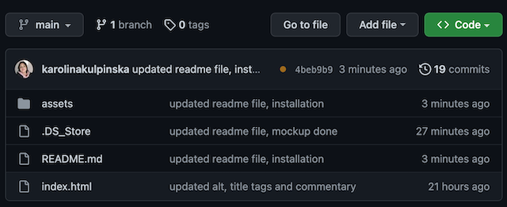
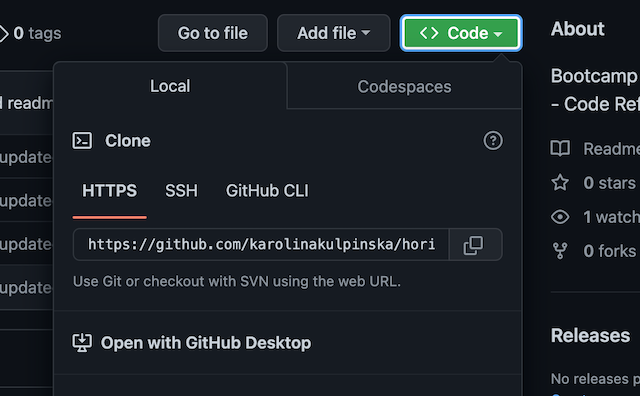

# Horiseon Webpage - Code Refactored

## Description

Businesses increasingly consider web accessibility when developing their websites. Providing assistive technologies such as video captions, screen readers, and braille keyboards, has an array of benefits: it makes a website available to people with disabilities (a disabled person's inability to access a company's website could also lead to litigation); as well as it helps to improve website's position in search engines like Google; just to name a few.

In the front-end and junior development world, one of the most common tasks is refactoring existing code to meet standards or to implement new technologies.

This week, my job was to improve the Horiseon website's accesibility by rewriting the code so that:
* semantic HTML elements can be found throughout the source code;
* HTML elements follow a logical structure independent of styling and positioning;
* links all function correctly;
* CSS selectors and properties are consolidated and organized;
* CSS and HTML files are properly commented;
* image and icon elements contain accessible `alt` attributes;
* heading attributes fall in sequential order;
* title elements contain a concise, descriptive title;
* repository contains multiple descriptive commit messages as well as a quality README file with description, screenshot, and link to deployed application.

I've also made sure that the application:
* loads with no errors;
* resembles mockup image as close as possible;
* follows best practices for file structure and naming conventions as well as class/id naming conventions, indentation, quality comments, etc.

Link to deployed application: https://karolinakulpinska.github.io/horiseon-webpage/

## Mockup provided by the Company


## Screenshot of the refactored website


## User Story

```
AS A marketing agency
I WANT a codebase that follows accessibility standards
SO THAT our own site is optimized for search engines
```

## Installation

Please follow the steps below to access code and install the project:

1. Access https://github.com/karolinakulpinska/horiseon-webpage
2. Above the list of files, click on green 'Code' button. 

3. Copy the URL for the repository.
- To clone the repository using HTTPS, under "HTTPS", click two files button.

- To clone the repository using an SSH key, including a certificate issued by your organization's SSH certificate authority, click SSH, then click two files button.
- To clone a repository using GitHub CLI, click GitHub CLI, then click two files button.
4. Open Terminal.
5. Change the current working directory to the location where you want the cloned directory.
6. Type `git clone`, and then paste the URL you copied earlier.

```
$ git clone https://github.com/karolinakulpinska/horiseon-webpage.git

```
7. Press Enter to create your local clone.

```
$ git clone https://github.com/karolinakulpinska/horiseon-webpage.git
> Cloning into `Horiseon-webpage`...
> remote: Counting objects: 10, done.
> remote: Compressing objects: 100% (8/8), done.
> remove: Total 10 (delta 1), reused 10 (delta 1)
> Unpacking objects: 100% (10/10), done.

```
